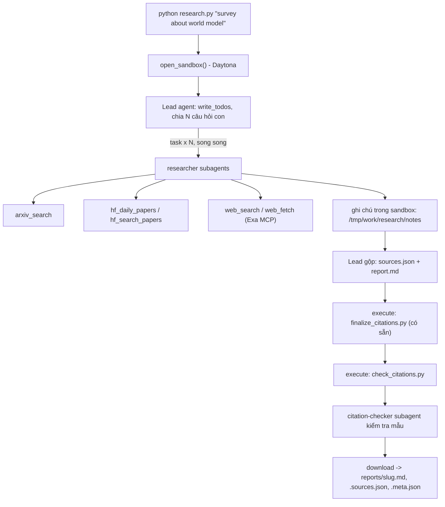

# Deep Research Agent (Deep Agents + Sandbox)

Lab dựng một **hệ thống deep research đa tác tử**: người dùng chỉ cần nhập một chủ đề (ví dụ `survey about world model`), hệ thống tự lập kế hoạch, giao việc cho nhiều subagent, tìm tài liệu trên arXiv, Hugging Face và web, rồi viết một **báo cáo có trích dẫn**.

Hình thức: **bài thực hành cá nhân**. Ngôn ngữ lập trình: Python 3.11 trở lên.

## Chạy bản đã cài đặt bằng Docker trên Windows

Bốn tệp bài tập đã được cài đặt. `.env.example` chọn sandbox Docker cục bộ;
không cần khóa Daytona khi dùng Docker. Mở Docker Desktop và chọn Linux containers.

```powershell
python -m venv .venv
.\.venv\Scripts\python.exe -m pip install -r requirements.txt
Copy-Item .env.example .env  # chỉ chạy nếu chưa có .env; giữ nguyên cấu hình hiện có
docker pull python:3.12-slim
```

Điền `LAB_MODEL` và khóa nhà cung cấp vào `.env`, dùng mô hình hỗ trợ tool calling;
giữ `SANDBOX=docker`. `EXA_API_KEY` là tùy chọn. Khóa chỉ được dùng ở host.
Exa dùng header `x-api-key` theo [tài liệu hiện tại](https://exa.ai/docs/get-started/exa-mcp),
thay cho tham số URL trong hướng dẫn lab ban đầu.
Khi Exa bị giới hạn tốc độ hoặc lỗi tạm thời sau retry, `web_fetch` có thể đọc
trực tiếp trang HTML/văn bản công khai từ arXiv, Hugging Face hoặc GitHub trên
host. Mọi chuyển hướng đều được kiểm tra tên miền; không thực thi mã của trang.
Researcher có thể dùng Daily Papers + papers search + trang bài báo gốc để duy
trì ba họ nguồn khi API tìm kiếm arXiv không dùng được; nhãn nguồn vẫn phản ánh
công cụ thực sự trả nội dung, không gán nhãn `arxiv` cho lời gọi API thất bại.

```powershell
.\.venv\Scripts\python.exe tools.py
.\.venv\Scripts\python.exe research.py "survey about world model"
.\.venv\Scripts\python.exe research.py --all
.\.venv\Scripts\python.exe self_check.py
```

`--all` chạy tuần tự năm chủ đề trong `topics.md` và dừng khi một lượt lỗi.
Nếu đã có một số báo cáo hợp lệ, dùng `research.py --all --resume` để chạy tiếp
các chủ đề còn thiếu mà không trả phí sinh lại báo cáo đã đạt kiểm tra.
Mỗi lượt thành công ghi ba tệp: `reports/<slug>.md` (báo cáo),
`.sources.json` (nguồn trích dẫn), `.meta.json` (chủ đề, mô hình, số lần gọi và token
của lead). Báo cáo và nguồn được giữ nguyên byte đã tải từ sandbox; finalizer và
validator chạy trong sandbox trước khi lưu. Lượt lỗi không tạo bộ báo cáo mới.
Metadata chỉ đếm token của lead, không bao gồm token của subagent.
Trước khi lưu, mã kiểm tra URL theo họ nguồn, cấu trúc 3–6 phần theo chủ đề và
trích dẫn trong mỗi đoạn/gạch đầu dòng. Nếu lỗi, lead có tối đa hai lượt sửa ngay
trong sandbox. Exa không khóa dùng cooldown chung sau khi đã hết retry để tránh
mọi researcher cùng chờ lại giới hạn đó cho từng URL.
Lỗi kết nối/timeout/lỗi tạm thời của LLM có tối đa ba lượt thử lại từ checkpoint
LangGraph trên cùng thread; sandbox vẫn được giữ trong lượt chạy đó. Checkpoint
nằm trong RAM, không tồn tại sau khi tiến trình bị dừng. `--resume` chỉ bỏ qua
các báo cáo đã hoàn tất và đã đạt kiểm tra, không khôi phục tiến trình đã bị tắt.
`normalize_report.py` là helper bổ sung: chuẩn hóa chữ hoa/cấp tiêu đề cố định
trong sandbox trước khi chạy finalizer có sẵn; không sửa khẳng định hay nguồn.
Kết quả Daily Papers thật được nạp sẵn vào sandbox để subagent có thể dùng khi
truy vấn riêng quá hẹp. Tất cả lỗi nội dung/metadata được trả cùng lúc cho lead.
Với mô hình reasoning OpenAI cần Responses API để dùng tools, đặt
`LAB_USE_RESPONSES_API=1` và `LAB_REASONING_EFFORT=low` trong `.env`.
Các tùy chọn này được áp dụng trong `research.py`; `model.py` có sẵn không sửa.

Kiểm tra mã không cần khóa LLM:

```powershell
.\.venv\Scripts\python.exe -m unittest discover -s tests -v
$env:RUN_DOCKER_TESTS = "1"
.\.venv\Scripts\python.exe -m unittest discover -s tests -v
```

Kiểm tra Docker tạo container thật, chạy finalizer/validator, tải tệp và xác nhận
container bị xóa sau lỗi. Nó dùng dữ liệu thử trong sandbox, không sinh báo cáo
nộp bài. Các tệp có sẵn `model.py`, `sandbox.py`, `self_check.py` và
`finalize_citations.py` được giữ nguyên.

## 1. Mục tiêu học tập

Sau lab, bạn có thể:

1. Dựng agent bằng thư viện Deep Agents (LangChain): công cụ (tool), system prompt, subagent, backend.
2. Dùng **sandbox** (Daytona) làm không gian làm việc và nơi chạy mã cho agent; hiểu vì sao khóa API và công cụ mạng phải nằm ở phía host chứ không nằm trong sandbox.
3. Viết công cụ gọi API ngoài **chịu được giới hạn tốc độ** (retry, backoff, jitter, `Retry-After`).
4. Thiết kế quy trình đa tác tử: lead chia nhỏ câu hỏi, giao cho N researcher chạy song song, tổng hợp và kiểm tra trích dẫn.
5. Tạo báo cáo có thể kiểm chứng: mọi khẳng định có `[n]` trỏ tới một nguồn có thật.

## 2. Hệ thống làm gì



Nguồn dữ liệu:

| Nguồn | Dùng để |
|---|---|
| arXiv API `https://export.arxiv.org/api/query` | Tìm bài theo từ khóa, sắp theo ngày |
| Hugging Face Daily Papers `/api/daily_papers` | Bài đang "trending": upvotes, githubRepo, summary |
| Hugging Face papers search `/api/papers/search?q=` | Tìm bài theo chủ đề |
| Web qua Exa MCP (`web_search_exa`, `web_fetch_exa`) | Blog, survey, trang dự án, nội dung đầy đủ của một URL |

## 3. Cấu trúc thư mục

```
Lab/
├── README.md  GUIDE.md  RUBRIC.md  REPORT_TEMPLATE.md   tài liệu
├── topics.md                 5 chủ đề cần chạy
├── requirements.txt  .env.example  .gitignore
├── model.py                  CÓ SẴN - không sửa: tạo mô hình LLM từ biến môi trường
├── sandbox.py                CÓ SẴN - không sửa: sandbox Daytona (hoặc Docker), upload, download
├── self_check.py             CÓ SẴN - không sửa: tự kiểm tra trước khi nộp (python self_check.py)
├── finalize_citations.py     CÓ SẴN - không sửa: script chạy trong sandbox, tự sinh `## References` và đánh số lại trích dẫn
├── tools.py                  SINH VIÊN CÀI ĐẶT: retry + 5 công cụ nguồn dữ liệu
├── agents.py                 SINH VIÊN CÀI ĐẶT: prompt, subagent, lead agent
├── research.py               SINH VIÊN CÀI ĐẶT: script chính
├── check_citations.py        SINH VIÊN CÀI ĐẶT: kiểm tra trích dẫn, chạy TRONG sandbox
└── reports/                  báo cáo sinh ra (bạn commit vào repo nộp)
```

Mỗi tệp "SINH VIÊN CÀI ĐẶT" là **pseudo-code chạy được** (import được): các hàm có docstring mô tả việc cần làm, các `TODO n` đánh số theo `GUIDE.md`, thân hàm đang `raise NotImplementedError`.

## 4. Cài đặt

```bash
python3 -m venv .venv && source .venv/bin/activate      # Python 3.11+
pip install -r requirements.txt
cp .env.example .env                                     # rồi điền khóa CỦA BẠN
```

Bạn cần ba loại khóa (điền vào `.env`, **không bao giờ commit** `.env`):

| Khóa | Lấy ở đâu | Ghi chú |
|---|---|---|
| LLM (`LAB_MODEL` + khóa nhà cung cấp) | Nhà cung cấp bạn chọn (OpenAI, Anthropic, Google, OpenRouter, Ollama...) | Mô hình **phải hỗ trợ tool calling**. Chép tên mô hình từ tài liệu của nhà cung cấp. |
| `DAYTONA_API_KEY` | https://app.daytona.io | Kiểm tra gói miễn phí / credit hiện hành. Không có tài khoản hoặc hết credit: đặt `SANDBOX=docker` để chạy sandbox trong container Docker cục bộ (xem `.env.example`). |
| `EXA_API_KEY` (khuyến nghị) | https://dashboard.exa.ai/api-keys | Có thể chạy không khóa, nhưng bản miễn phí của MCP bị giới hạn tốc độ rất nhanh. |

## 5. Làm bài

Làm theo thứ tự (chi tiết trong `GUIDE.md`):

1. `check_citations.py`: khởi động nhẹ, thuần Python.
2. `tools.py`: viết `with_retry` và 5 công cụ. Thử riêng từng công cụ: `python tools.py`.
3. `agents.py`: viết prompt, subagent và lead agent.
4. `research.py`: ghép tất cả; chạy một chủ đề:

```bash
python research.py "survey about world model"
```

Kết quả nằm ở `reports/survey-about-world-model.md` cùng `.sources.json` và `.meta.json`.

## 6. Chủ đề và nộp bài

- Chạy đủ **5 chủ đề** trong [`topics.md`](topics.md), mỗi chủ đề một lần.
- Commit mã nguồn và toàn bộ `reports/`, đẩy lên một **public repo** GitHub và nộp link.
- Kiểm tra trước khi nộp: chạy **`python self_check.py`** (không tốn token): nó kiểm tra đủ 5 báo cáo, `meta.json`, trích dẫn bằng `check_citations.py` của bạn, và không có `.env`/khóa nào trong git.
- Cách chấm: xem [`RUBRIC.md`](RUBRIC.md).

## 7. Thời gian, chi phí và an toàn

- Dùng một mô hình **rẻ nhưng hỗ trợ tool calling**, và **đặt giới hạn** (số lần gọi mô hình/công cụ cho lead và subagent, `recursion_limit`): một prompt hỏng có thể khiến agent lặp rất lâu. Đây là hạng mục 2.5 của `RUBRIC.md`.
- Kết quả có tính ngẫu nhiên: cùng một mã có thể cho báo cáo hợp lệ ở lần này và trích dẫn lỗi ở lần sau. Hãy sửa **prompt và mã**, không sửa tay báo cáo.

- Mỗi lần chạy tốn token LLM và thời gian sandbox. `tokens` trong `meta.json` chỉ đếm tin nhắn của lead, chưa gồm subagent, nên chi phí thật cao hơn. `open_sandbox()` luôn dừng và xóa sandbox khi kết thúc, kể cả khi lỗi. Đừng bỏ qua nó.
- **Không đưa bí mật vào sandbox.** Sandbox không ngăn được prompt injection hay việc đẩy dữ liệu ra mạng; một trang web độc hại có thể khiến agent chạy lệnh bên trong sandbox. Vì vậy mọi công cụ gọi mạng và mọi khóa ở lại phía host.
- Nội dung lấy từ web là **dữ liệu không đáng tin**: agent không được làm theo chỉ dẫn nằm trong đó.
